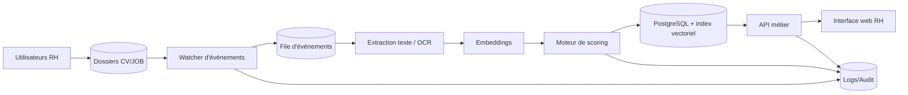
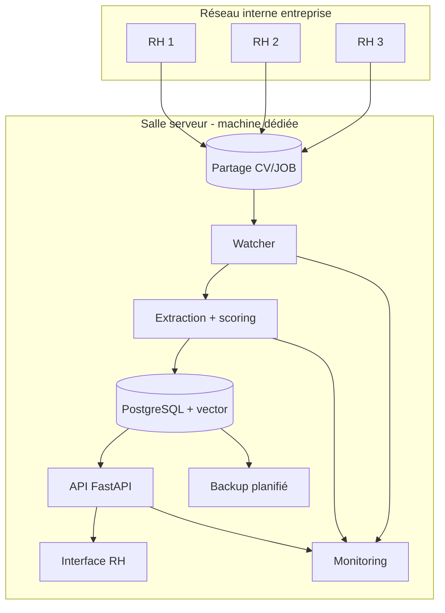
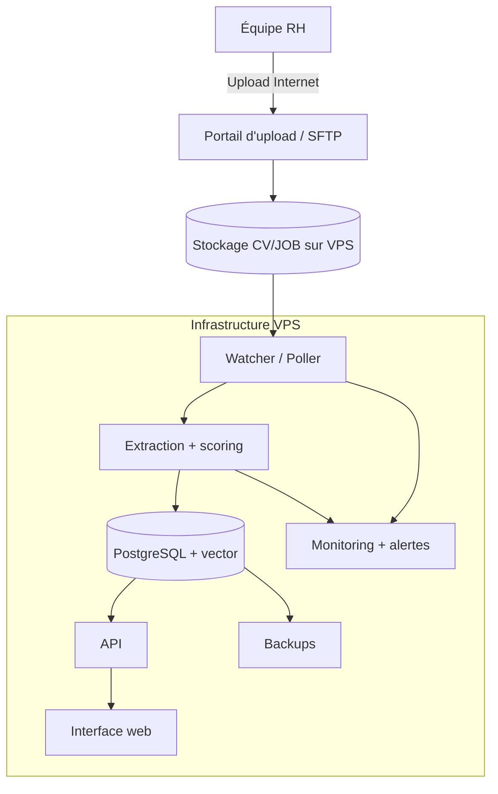
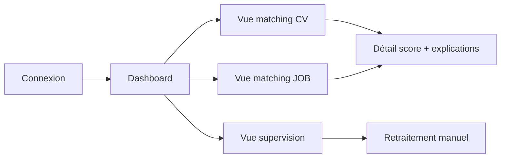

# Dossier d'architecture complet - Plateforme AI Real-Time CV/JOB

Date : 17 mars 2026  
Public cible : Direction générale, DSI, RH, équipe projet  
Version : 1.0

## 1. Résumé exécutif

L'entreprise souhaite mettre en place un moteur de scoring CV/JOB en temps réel dans un contexte local multi-utilisateurs RH, avec des modifications fréquentes des fichiers.

Le besoin principal est de recalculer rapidement les correspondances quand un CV ou une fiche JOB est créé, modifié ou supprimé.

Deux architectures cibles sont proposées :

1. Architecture A - Serveur dédié en salle serveur (On-Prem)
2. Architecture B - VPS (Cloud)

---

## 2. Contexte et contraintes

### 2.1 Contexte métier

- Plusieurs personnes RH travaillent en parallèle.
- Deux corpus documentaires : CV et JOB.
- Les fichiers évoluent en continu au fil de la journée.
- Le scoring doit rester quasi instantané pour supporter la décision.

### 2.2 Contraintes techniques

- Le système doit tolérer des modifications fréquentes sans retraitements inutiles.
- Le système doit gérer des formats hétérogènes (PDF, DOCX, TXT, images scannées).
- La solution doit rester simple à exploiter par une équipe non experte.

### 2.3 Exigences de performance (cibles)

- Détection d'un changement de fichier : < 5 secondes.
- Recalcul incrémental pour 1 événement : < 30 secondes (typique).
- Disponibilité du service : >= 99% en heures ouvrables.

---

## 3. Exigences fonctionnelles et non fonctionnelles

### 3.1 Exigences fonctionnelles

1. Surveiller en continu les dossiers CV et JOB.
2. Extraire le texte des documents et normaliser les contenus.
3. Construire des embeddings et un score de matching.
4. Recalculer uniquement ce qui est impacté (incrémental).
5. Exposer les résultats via API et interface web interne.
6. Journaliser les traitements, erreurs et reprises.

### 3.2 Exigences non fonctionnelles

1. Sécurité d'accès par rôles (RH, manager RH, admin).
2. Traçabilité complète des événements et recalculs.
3. Sauvegardes quotidiennes automatisées.
4. Supervision technique (santé, files d'attente, erreurs).
5. Capacité d'évolution sans refonte totale.

---

## 4. Architecture fonctionnelle de référence

Cette architecture logique est commune aux deux options :



### 4.1 Principes techniques essentiels

1. Debounce de fichier : attendre la stabilisation d'écriture avant traitement.
2. Hash de contenu : éviter les recalculs en doublon.
3. Recalcul incrémental : ne traiter que les entités impactées.
4. Retry contrôlé : reprise automatique si erreur temporaire.
5. Idempotence : un même événement ne doit pas produire des résultats incohérents.

---

## 5. Option A - Serveur dédié en salle serveur (On-Prem)

### 5.1 Description

Le Modèle 1 repose sur une règle simple : un seul point central officiel contient tous les fichiers CV et JOB.

Dans ce modèle, les RH conservent leurs postes habituels, mais travaillent directement dans des dossiers partagés hébergés sur une machine centrale (serveur interne ou NAS), et non dans des dossiers locaux dispersés.

#### 5.1.1 Principe directeur

1. Les RH utilisent leurs PC comme d'habitude.
2. Les fichiers CV/JOB sont stockés sur le serveur central.
3. Le watcher tourne sur ce serveur central et détecte les changements en continu.
4. Le pipeline d'analyse calcule les scores puis met à jour l'interface RH.

#### 5.1.2 Définitions des concepts clés

| Concept | Définition opérationnelle |
|---|---|
| Point central | Emplacement unique de référence pour tous les fichiers CV et JOB |
| Serveur interne | Machine de l'entreprise, disponible en continu, hébergeant les dossiers et services |
| NAS | Équipement de stockage réseau centralisé, alternative au serveur classique |
| Partage réseau | Dossier accessible à plusieurs utilisateurs via le réseau local |
| SMB / NFS | Protocoles de partage réseau (SMB fréquent en environnement Windows, NFS fréquent côté Linux) |
| Lecteur réseau | Dossier partagé monté sur un PC RH comme un disque accessible |
| Watcher | Service qui détecte les créations, modifications et suppressions de fichiers |
| Pipeline de traitement | Chaîne complète : détection, extraction, scoring, stockage, publication |
| Extraction | Récupération du texte depuis PDF, DOCX, TXT ou image scannée |
| Scoring | Calcul du niveau de correspondance entre CV et JOB |
| Latence | Délai entre modification d'un fichier et affichage du nouveau résultat |
| LAN | Réseau local interne de l'entreprise |

#### 5.1.3 Fonctionnement opérationnel (pas à pas)

1. L'équipe IT crée deux dossiers partagés centraux : CV et JOB.
2. L'équipe IT attribue les droits d'accès au groupe RH (lecture/écriture).
3. Chaque poste RH connecte ces partages en lecteurs réseau.
4. Les RH ouvrent, modifient et enregistrent les documents directement dans ces lecteurs réseau.
5. Le watcher détecte immédiatement chaque événement de fichier.
6. Un délai de stabilisation est appliqué pour éviter de traiter un fichier encore en cours d'écriture.
7. Le système calcule une empreinte de contenu (hash) pour ignorer les faux changements.
8. Si un changement réel est confirmé, l'extraction de texte est lancée.
9. Le moteur de matching recalcule les scores impactés.
10. Les résultats sont enregistrés en base de données.
11. L'interface RH affiche les nouveaux classements et les détails explicatifs.
12. Les journaux techniques conservent la traçabilité complète du traitement.

#### 5.1.4 Pourquoi le traitement est quasi immédiat

1. Le watcher surveille un stockage local au réseau interne.
2. Aucun upload Internet n'est nécessaire avant le calcul.
3. La détection est événementielle et non planifiée par lot.
4. Le délai total est principalement lié au temps de traitement IA.

#### 5.1.5 Règle essentielle d'usage RH

Le fichier doit être créé ou modifié dans le dossier partagé central.

Si un utilisateur travaille uniquement dans un dossier local de son PC (par exemple Documents), le watcher ne peut pas détecter ce changement tant que le fichier n'est pas copié vers le partage réseau.

#### 5.1.6 Exemple réel chronologique

1. 10:00:00 : RH1 modifie un CV dans le lecteur réseau CV.
2. 10:00:02 : le watcher détecte la modification.
3. 10:00:04 : fin de stabilisation d'écriture.
4. 10:00:05 : extraction du contenu.
5. 10:00:09 : scoring recalculé.
6. 10:00:10 : base de données mise à jour.
7. 10:00:11 : résultat visible dans l'interface RH.

### 5.2 Schéma Mermaid



### 5.3 Avantages

1. Latence très faible en usage local.
2. Changement minimal pour les RH (lecteur réseau partagé).
3. Données majoritairement en interne.
4. Indépendance Internet pour le cœur du processus.
5. Coût récurrent faible après installation.

### 5.4 Limites

1. Point de panne unique si une seule machine.
2. Maintenance matérielle locale.
3. Montée en charge plus limitée qu'un cloud élastique.

### 5.5 Profil de coût

- CAPEX : moyen (matériel + mise en service).
- OPEX : faible à moyen (énergie, maintenance, sauvegardes).

### 5.6 Cas d'usage recommandé

- Équipe RH majoritairement sur un seul site.
- Besoin de réactivité immédiate.
- Priorité à la simplicité opérationnelle.

---

## 6. Option B - VPS (Cloud)

### 6.1 Description

Le Modèle 2 repose sur un point central officiel hébergé dans le cloud sur un VPS (par exemple OVH).

Dans ce modèle, les RH travaillent depuis leurs postes habituels, mais les fichiers CV/JOB doivent être transférés vers le stockage central du VPS pour être pris en compte par le watcher.

#### 6.1.1 Principe directeur

1. Les RH utilisent leurs PC comme d'habitude.
2. Les fichiers CV/JOB sont déposés sur le stockage central du VPS.
3. Le watcher tourne sur le VPS et détecte les nouveaux fichiers ou les fichiers modifiés.
4. Le pipeline d'analyse calcule les scores puis met à jour l'interface web.

#### 6.1.2 Définitions des concepts clés

| Concept | Définition opérationnelle |
|---|---|
| Point central cloud | Emplacement unique de référence hébergé à distance pour les fichiers CV/JOB |
| VPS | Serveur virtuel privé accessible via Internet |
| Portail d'upload | Interface web sécurisée utilisée par les RH pour déposer les fichiers |
| SFTP | Protocole sécurisé de transfert de fichiers vers le VPS |
| Synchronisation | Mécanisme automatique qui copie les fichiers locaux vers le VPS |
| Watcher | Service qui détecte les créations, modifications et suppressions sur le stockage du VPS |
| Pipeline de traitement | Chaîne complète : détection, extraction, scoring, stockage, publication |
| Débit montant (upload) | Vitesse à laquelle un poste RH envoie un fichier vers Internet |
| Latence réseau | Délai lié au transport des données entre les postes RH et le VPS |
| Quasi temps réel | Mise à jour rapide mais dépendante du temps de transfert Internet |
| Chiffrement TLS | Protection des échanges réseau entre postes RH et services VPS |
| Supervision cloud | Suivi de la santé des services, erreurs et performances côté VPS |

#### 6.1.3 Fonctionnement opérationnel (pas à pas)

1. L'équipe IT provisionne le VPS et configure les services (watcher, API, base, interface).
2. L'équipe IT prépare les espaces CV et JOB sur le stockage du VPS.
3. L'équipe IT met en place les accès sécurisés (HTTPS, SFTP, comptes, droits).
4. Les RH déposent les fichiers via portail d'upload, SFTP ou synchronisation automatique.
5. Le watcher détecte l'arrivée d'un nouveau fichier ou une mise à jour.
6. Un délai de stabilisation est appliqué pour éviter un traitement trop tôt pendant un transfert.
7. Le système calcule un hash de contenu pour éviter les retraitements inutiles.
8. Si le changement est confirmé, l'extraction de texte est lancée.
9. Le moteur de matching recalcule les scores impactés.
10. Les résultats sont enregistrés en base de données.
11. L'interface web publie les nouveaux classements.
12. Les logs techniques assurent la traçabilité complète des opérations.

#### 6.1.4 Pourquoi le traitement est quasi immédiat (et non instantané)

1. Le watcher sur VPS réagit immédiatement après réception du fichier.
2. Le délai global dépend du transfert Internet avant le démarrage du calcul.
3. Plus le fichier est volumineux ou le débit upload faible, plus le délai augmente.
4. Le temps total combine transfert, traitement IA et publication dans l'interface.

#### 6.1.5 Règle essentielle d'usage RH

Le fichier local d'un RH n'est visible du système qu'après transfert effectif vers le VPS.

Si un fichier est modifié localement mais non synchronisé, le watcher distant ne peut pas le détecter et aucun recalcul n'est lancé.

#### 6.1.6 Exemple réel chronologique

1. 10:00:00 : RH2 modifie un CV sur son PC local.
2. 10:00:03 : la synchronisation vers le VPS démarre.
3. 10:00:18 : le transfert se termine.
4. 10:00:19 : le watcher VPS détecte le changement.
5. 10:00:21 : fin de stabilisation et contrôle hash.
6. 10:00:24 : extraction du contenu.
7. 10:00:27 : scoring recalculé.
8. 10:00:28 : résultat visible dans l'interface web RH.

### 6.2 Schéma Mermaid



### 6.3 Avantages

1. Accès simple depuis plusieurs sites géographiques.
2. Scalabilité plus flexible.
3. Pas de matériel local à maintenir.

### 6.4 Limites

1. Dépendance à Internet pour le dépôt des fichiers.
2. Latence variable selon le débit d'upload.
3. Exposition sécuritaire plus sensible (système en ligne).
4. Coût mensuel récurrent.

### 6.5 Profil de coût

- CAPEX : faible.
- OPEX : moyen à élevé (serveur, stockage, sauvegarde, trafic).

### 6.6 Cas d'usage recommandé

- Équipes distribuées multi-sites.
- Équipe IT mature sur sécurité cloud.
- Volonté d'évolutivité rapide.

---

## 7. Comparatif de décision

| Critère | Option A (On-Prem) | Option B (VPS) |
|---|---:|---:|
| Simplicité de démarrage | 5/5 | 3/5 |
| Latence locale | 5/5 | 3/5 |
| Scalabilité | 3/5 | 5/5 |
| Coût initial | 3/5 | 5/5 |
| Coût récurrent | 4/5 | 3/5 |
| Sécurité (surface exposée) | 4/5 | 3/5 |
| Adéquation contexte RH local | 5/5 | 3/5 |

Lecture rapide :

1. Option A gagne sur simplicité et temps réel local.
2. Option B gagne sur élasticité globale et l'accès multi-sites.

---

## 8. Proposition d'interface visuelle (simple et efficace)

### 8.1 Principes UX

1. Navigation courte en 4 écrans maximum.
2. Lecture immédiate des priorités RH.
3. Actions rapides : filtrer, valider, retraiter.
4. Visibilité claire des erreurs techniques.

### 8.2 Écrans cibles

1. Dashboard
2. Matching par CV
3. Matching par JOB
4. Supervision / erreurs

### 8.3 Schéma de navigation Mermaid



### 8.4 Données affichées à l'écran

- Score global par paire CV/JOB.
- Mots-clés en commun.
- Points forts et points faibles.
- Date/heure du dernier recalcul.
- Statut de traitement et erreurs.

---

## 9. Sécurité, conformité, exploitation

### 9.1 Sécurité

1. Authentification des utilisateurs.
2. RBAC : RH, manager RH, admin technique.
3. Chiffrement des flux réseau internes critiques.
4. Journal d'audit inviolable des actions.

### 9.2 Sauvegarde et reprise

1. Sauvegarde quotidienne base + fichiers critiques.
2. Rétention 30 jours minimum.
3. Test de restauration mensuel.
4. Procédure de reprise documentée (RTO/RPO).

### 9.3 Supervision

1. Disponibilité des services.
2. Taille de la file d'événements.
3. Taux d'erreurs extraction/scoring.
4. Espace disque et état des sauvegardes.

---

## 10. KPI de pilotage

1. Temps moyen détection fichier -> score publié.
2. Taux de traitements réussis.
3. Nombre d'événements en attente.
4. Taux de faux positifs/faux négatifs perçu RH.
5. Taux d'utilisation de l'interface.

Objectif initial recommandé :

- 95% des mises à jour traitées en moins de 60 secondes.

---

## 11. Risques et mitigations

1. Risque : surcharge lors de pics de dépôts.
- Mitigation : file asynchrone + workers parallèles + priorisation.

2. Risque : données de mauvaise qualité (scans illisibles).
- Mitigation : OCR robuste + contrôles de qualité + alerte RH.

3. Risque : interruption machine locale (Option A).
- Mitigation : sauvegarde + VM de secours + procédure failover.

4. Risque : dépendance Internet (Option B).
- Mitigation : reprise sur incident + buffer local + retry intelligent.

---

## 12. Conclusion

Ce document présente l'architecture salle serveur (Option A) en premier pour refléter les besoins de réactivité locale et de simplicité opérationnelle dans un contexte RH interne.

L'architecture VPS (Option B) reste une alternative pertinente dès qu'un besoin fort d'accès distant multi-sites et de scalabilité apparaît.

---

## Annexe A - Arborescence logique recommandée

```text
/ai-realtime
  /storage
    /cv
    /job
    /archive
  /services
    /watcher
    /scoring-api
    /worker
    /frontend
  /data
    /postgres
    /vector-index
  /ops
    /backup
    /monitoring
    /runbooks
```

## Annexe B - Stack technique cible (MVP)

- Watcher : Python Watchdog
- API : FastAPI
- Scoring : sentence-transformers + FAISS
- Base : PostgreSQL
- Frontend : React ou HTMX
- Queue : Redis (optionnel au début, recommandé ensuite)
- Déploiement : Docker Compose
