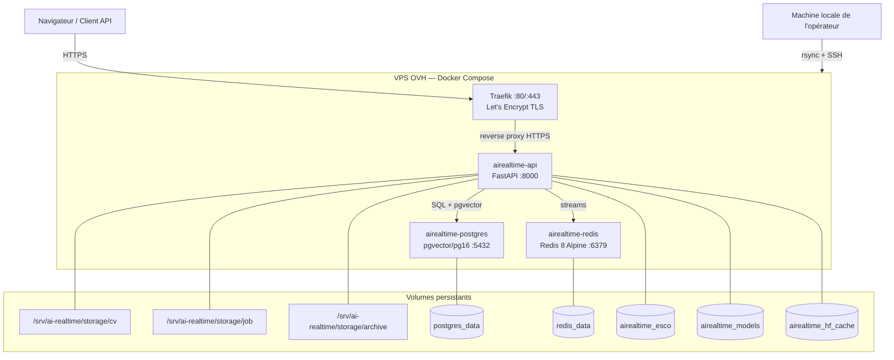
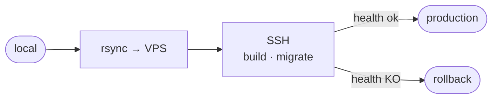

# Guide de déploiement Cloud — Mode B : Déploiement manuel (SSH + rsync)

**Projet** : AI Real-Time — Plateforme de matching CV ↔ Offres d'emploi  
**Cible** : VPS OVH, Ubuntu 24.04  
**Mode** : Déploiement manuel depuis la machine de l'opérateur (SSH + rsync, sans GitHub Actions)  
**Audience** : Développeur junior / stagiaire  
**Dernière mise à jour** : Juin 2026

---

## Table des matières

1. [Architecture de déploiement](#1-architecture-de-déploiement)
2. [Règles d'or](#2-règles-dor)
3. [Variables à collecter avant de commencer](#3-variables-à-collecter-avant-de-commencer)
4. [Catalogue complet des variables d'environnement](#4-catalogue-complet-des-variables-denvironnement)
5. [Préparation de la machine locale](#5-préparation-de-la-machine-locale)
6. [Préparation du serveur OVH](#6-préparation-du-serveur-ovh)
7. [Déploiement initial](#7-déploiement-initial)
8. [Déploiements suivants — mise à jour](#8-déploiements-suivants--mise-à-jour)
9. [Vérification go-live](#9-vérification-go-live)
10. [Sauvegardes et restauration](#10-sauvegardes-et-restauration)
11. [Surveillance et logs](#11-surveillance-et-logs)
12. [Procédure de rollback](#12-procédure-de-rollback)
13. [Erreurs courantes](#13-erreurs-courantes)
14. [Escalade](#14-escalade)

---

## 1. Architecture de déploiement

### 1.1 Schéma des services



### 1.2 Flux de déploiement manuel



### 1.3 Ports et pare-feu

| Port | Protocole | Ouvert vers l'extérieur | Usage |
|------|-----------|------------------------|-------|
| 22   | TCP       | Oui (restreindre par IP si possible) | SSH |
| 80   | TCP       | Oui | Traefik HTTP → redirect HTTPS |
| 443  | TCP       | Oui | Traefik HTTPS (API) |
| 5432 | TCP       | Non (interne Docker) | PostgreSQL |
| 6379 | TCP       | Non (interne Docker) | Redis |
| 8000 | TCP       | Non (interne Docker) | FastAPI (via Traefik) |

> **Note importante** : Le port 8000 n'est jamais exposé directement. Tout le trafic passe par Traefik sur les ports 80/443. Ne jamais ouvrir le port 8000 dans le pare-feu OVH.

---

## 2. Règles d'or

> Ces règles s'appliquent **en toutes circonstances**. En cas de doute, ne pas agir et escalader.

1. **Ne jamais modifier `.env.cloud` en production sans en informer l'équipe** — un redémarrage des conteneurs applique immédiatement les changements.
2. **Toujours sauvegarder la base de données avant une migration Alembic** — les migrations ne sont pas automatiquement réversibles.
3. **Le build Docker prend 20 à 40 minutes la première fois** — ne pas fermer le terminal ni interrompre le processus. Les builds suivants sont plus rapides grâce au cache des layers.
4. **`AI_REALTIME_JWT_SECRET_KEY` doit être un secret fort en production** — la valeur par défaut `change-me` ouvre toutes les sessions JWT à une attaque de force brute triviale.
5. **Ne jamais committer `.env.cloud` dans Git** — ce fichier contient les mots de passe de base de données et les clés API. Le fichier `.gitignore` doit l'exclure.
6. **Traefik gère TLS automatiquement** — ne pas installer Nginx ni Certbot manuellement, cela entrerait en conflit.
7. **Les volumes Docker sont la seule source de vérité pour les données** — ne jamais utiliser `docker compose down -v` sans sauvegarde préalable (cette commande détruit toutes les données).
8. **Synchroniser depuis Git, pas depuis le système de fichiers local** — toujours s'assurer que les modifications locales sont commitées et que `git status` est propre avant de déployer.

---

## 3. Variables à collecter avant de commencer

Avant toute intervention, rassembler les informations suivantes dans un gestionnaire de mots de passe (Bitwarden, 1Password, etc.) :

| Information | Exemple | Où la trouver / Comment générer |
|-------------|---------|--------------------------------|
| IP publique du VPS | `51.178.42.10` | Espace client OVH |
| Nom de domaine pointant vers le VPS | `api.monentreprise.com` | Gestionnaire DNS |
| Adresse email pour Let's Encrypt | `devops@monentreprise.com` | Équipe |
| Chemin de la clé SSH locale | `~/.ssh/id_ed25519_airealtime` | Générée à l'étape 5 |
| Nom d'utilisateur SSH sur le serveur | `deploy` | Défini à l'étape 6 |
| Mot de passe PostgreSQL | (40+ caractères aléatoires) | `openssl rand -hex 32` |
| Clé(s) API pour l'application | (40+ caractères aléatoires) | `openssl rand -hex 32` |
| Secret JWT | (40+ caractères aléatoires) | `openssl rand -hex 32` |

> **Conseil** : Générer tous les secrets en une seule fois avant de commencer et les stocker de manière sécurisée. Ne jamais les noter dans un fichier texte non chiffré.

```bash
# Générer les trois secrets d'un coup
echo "POSTGRES_PASSWORD=$(openssl rand -hex 32)"
echo "AIREALTIME_API_KEYS=$(openssl rand -hex 32)"
echo "AI_REALTIME_JWT_SECRET_KEY=$(openssl rand -hex 32)"
```

---

## 4. Catalogue complet des variables d'environnement

### 4.1 Variables du fichier `.env.cloud` (obligatoires)

| Variable | Défaut fourni | Obligatoire | Remarques |
|----------|---------------|-------------|-----------|
| `AIREALTIME_DOMAIN` | `example.com` | Oui | Domaine complet sans protocole (`api.monentreprise.com`) |
| `TRAEFIK_EMAIL` | `admin@example.com` | Oui | Email pour les notifications Let's Encrypt |
| `POSTGRES_DB` | `airealtime` | Oui | Nom de la base de données |
| `POSTGRES_USER` | `airealtime` | Oui | Utilisateur PostgreSQL |
| `POSTGRES_PASSWORD` | `change-me` | Oui | **Changer impérativement** — `openssl rand -hex 32` |
| `AIREALTIME_API_KEYS` | `change-me` | Oui | Clé(s) API séparées par virgule — `openssl rand -hex 32` |
| `AIREALTIME_CORS_ALLOW_ORIGINS` | `https://example.com` | Oui | Origines CORS autorisées (domaine du frontend) |

### 4.2 Variables supplémentaires (à ajouter dans `.env.cloud`)

| Variable | Défaut | Obligatoire | Remarques |
|----------|--------|-------------|-----------|
| `AI_REALTIME_JWT_SECRET_KEY` | `change-me` | **Oui en prod** | Secret JWT HS256 — **absent de `.env.cloud.example`**, à ajouter manuellement |
| `AI_REALTIME_QUEUE_BACKEND` | `stream` | Non | `stream` (Redis activé) ou `memory` (dev only, sans Redis) |
| `AI_REALTIME_NER_ENABLED` | `true` | Non | Active l'extraction NER (CamemBERT + spaCy) |
| `AI_REALTIME_EMBEDDING_ENABLED` | `true` | Non | Active les embeddings sémantiques (sentence-transformers) |
| `AI_REALTIME_LOG_LEVEL` | `INFO` | Non | `INFO` ou `DEBUG` (verbeux, éviter en prod) |
| `AI_REALTIME_LOG_JSON` | `true` | Non | Format JSON structuré (recommandé en prod) |
| `AI_REALTIME_REQUIRE_API_KEY` | `true` | Non | Exiger une clé API sur tous les endpoints |
| `AI_REALTIME_HYBRID_SCORING_ENABLED` | `true` | Non | Active le scoring hybride (vectoriel + lexical) |
| `AI_REALTIME_HYBRID_VECTOR_WEIGHT` | `0.3` | Non | Poids du score vectoriel dans le score hybride |
| `AI_REALTIME_HYBRID_LEXICAL_WEIGHT` | `0.7` | Non | Poids du score lexical dans le score hybride |
| `AI_REALTIME_OCR_LANGUAGES` | `fra+eng` | Non | Langues Tesseract pour l'OCR (format Tesseract) |
| `AI_REALTIME_ESCO_ENRICH_SKILLS` | `true` | Non | Enrichit les compétences avec la taxonomie ESCO |
| `AI_REALTIME_CONVERSION_USE_DOCLING` | `true` | Non | Utilise Docling pour la conversion PDF (layer 1) |
| `AI_REALTIME_NER_BACKEND` | `camembert` | Non | Backend NER : `camembert` ou `spacy` |

> **Note** : Toutes les variables `AI_REALTIME_*` ont des valeurs par défaut sensées dans `backend/app/settings.py`. Ne surcharger que ce qui doit différer de la valeur par défaut.

---

## 5. Préparation de la machine locale

### 5.1 Prérequis sur la machine de l'opérateur

S'assurer que les outils suivants sont installés :

```bash
# Vérifier les outils nécessaires
git --version        # git >= 2.30
ssh -V               # OpenSSH
rsync --version      # rsync >= 3.0
docker --version     # Docker >= 24 (optionnel, pour tester localement)
```

### 5.2 Générer la clé SSH de déploiement

```bash
# Générer une paire de clés dédiée au déploiement
ssh-keygen -t ed25519 -C "airealtime-deploy-$(date +%Y%m%d)" \
  -f ~/.ssh/id_ed25519_airealtime

# Afficher la clé publique — à copier sur le serveur
cat ~/.ssh/id_ed25519_airealtime.pub
```

### 5.3 Configurer le raccourci SSH (optionnel mais recommandé)

Ajouter dans `~/.ssh/config` :

```
Host airealtime-vps
    HostName <IP_VPS>
    User deploy
    IdentityFile ~/.ssh/id_ed25519_airealtime
    Port 22
```

Cela permet d'utiliser `ssh airealtime-vps` au lieu de `ssh -i ~/.ssh/id_ed25519_airealtime deploy@<IP_VPS>`.

### 5.4 Cloner le dépôt en local (si pas déjà fait)

```bash
git clone https://github.com/99ch/AI-reel-time.git ~/projets/ai-realtime
cd ~/projets/ai-realtime
```

---

## 6. Préparation du serveur OVH

### 6.1 Connexion initiale et création d'un utilisateur dédié

```bash
# Depuis la machine locale — connexion initiale en root
ssh root@<IP_VPS>

# Créer l'utilisateur de déploiement
adduser deploy
usermod -aG sudo deploy

# Passer sur l'utilisateur deploy pour la suite
su - deploy
```

### 6.2 Installer la clé SSH sur le serveur

```bash
# Sur le serveur (en tant que "deploy")
mkdir -p ~/.ssh
chmod 700 ~/.ssh

# Coller la clé publique affichée à l'étape 5.2
echo "<COLLER_LA_CLE_PUBLIQUE_ICI>" >> ~/.ssh/authorized_keys
chmod 600 ~/.ssh/authorized_keys
```

Tester depuis la machine locale (nouvelle fenêtre de terminal) :

```bash
ssh airealtime-vps   # ou : ssh -i ~/.ssh/id_ed25519_airealtime deploy@<IP_VPS>
# Doit se connecter sans mot de passe
```

### 6.3 Bootstrap du serveur

Le script `scripts/vm/bootstrap_ubuntu.sh` installe automatiquement Docker Engine, Docker Compose plugin, Python 3.11, Node.js 22, Tesseract, LibreOffice et crée les répertoires de stockage.

```bash
# Sur le serveur — cloner le dépôt (une seule fois)
git clone https://github.com/99ch/AI-reel-time.git /srv/ai-realtime/app
cd /srv/ai-realtime/app

# Lancer le bootstrap (requiert sudo)
sudo bash scripts/vm/bootstrap_ubuntu.sh
```

> **Attention** : Après le bootstrap, se déconnecter et se reconnecter (ou exécuter `newgrp docker`) pour que l'appartenance au groupe `docker` prenne effet, sinon `docker` retourne une erreur de permission.

```bash
# Après reconnexion — vérifier que tout est en place
bash /srv/ai-realtime/app/scripts/vm/verify_stack.sh
```

Sortie attendue : tous les éléments affichent `[OK]`. Si un élément affiche `[MISSING]` ou `[WARN]`, corriger avant de continuer.

### 6.4 Créer les répertoires supplémentaires

```bash
# Sur le serveur
mkdir -p /srv/ai-realtime/backups
mkdir -p /srv/ai-realtime/logs
```

### 6.5 Vérifier les ports OVH (pare-feu)

Dans l'espace client OVH → Manager → Bare Metal Cloud → VPS → section "Réseau" ou "Sécurité" :

| Règle | Action | Port(s) | Source |
|-------|--------|---------|--------|
| SSH   | Autoriser | 22/TCP | Votre IP fixe (ou `0.0.0.0/0` si IP dynamique) |
| HTTP  | Autoriser | 80/TCP | `0.0.0.0/0` |
| HTTPS | Autoriser | 443/TCP | `0.0.0.0/0` |
| Tout le reste | Bloquer | — | — |

---

## 7. Déploiement initial

### 7.1 Créer le fichier `.env.cloud` sur le serveur

Ce fichier contient tous les secrets de production. Il **ne doit jamais être commité dans Git** et ne doit jamais être transféré par rsync (voir section 8 pour les exclusions rsync).

```bash
# Sur le serveur
cp /srv/ai-realtime/app/deploy/cloud/.env.cloud.example \
   /srv/ai-realtime/app/deploy/cloud/.env.cloud

nano /srv/ai-realtime/app/deploy/cloud/.env.cloud
```

Remplir avec les vraies valeurs (remplacer les placeholders par les secrets générés à l'étape 3) :

```bash
AIREALTIME_DOMAIN=api.monentreprise.com
TRAEFIK_EMAIL=devops@monentreprise.com
POSTGRES_DB=airealtime
POSTGRES_USER=airealtime
POSTGRES_PASSWORD=<SECRET_GENERE_AVEC_OPENSSL>
AIREALTIME_API_KEYS=<SECRET_GENERE_AVEC_OPENSSL>
AIREALTIME_CORS_ALLOW_ORIGINS=https://api.monentreprise.com
AI_REALTIME_JWT_SECRET_KEY=<SECRET_GENERE_AVEC_OPENSSL>
```

Protéger le fichier en lecture :

```bash
chmod 600 /srv/ai-realtime/app/deploy/cloud/.env.cloud
```

### 7.2 Vérifier le pointage DNS

```bash
# Depuis la machine locale
dig +short api.monentreprise.com
# Doit retourner l'IP du VPS (ex : 51.178.42.10)
```

Si le DNS ne pointe pas encore vers le VPS, configurer l'enregistrement A dans votre gestionnaire DNS et attendre la propagation (généralement 5 à 30 minutes sur OVH, jusqu'à 24h selon le TTL).

### 7.3 Lancer le premier build Docker

> **Avertissement important** : La première exécution de `docker compose up --build` télécharge et compile tous les modèles ML (CamemBERT NER ~440 Mo, sentence-transformers ~500 Mo, Docling ~250 Mo, PyTorch CPU ~1,2 Go). Cette opération prend **20 à 40 minutes** selon la connexion du serveur.
>
> Utiliser `screen` ou `tmux` pour éviter qu'une déconnexion SSH interrompe le build.

```bash
# Sur le serveur — lancer screen pour protéger la session
screen -S airealtime-deploy

# Se placer dans le répertoire du projet
cd /srv/ai-realtime/app

# Lancer le build (20-40 min la première fois)
docker compose \
  --env-file deploy/cloud/.env.cloud \
  -f deploy/cloud/docker-compose.cloud.yml \
  up --build -d

# Si la connexion SSH est interrompue, se reconnecter et reprendre avec :
# screen -r airealtime-deploy
```

Surveiller la progression (dans une autre fenêtre SSH) :

```bash
# Logs en temps réel du build
docker compose \
  --env-file /srv/ai-realtime/app/deploy/cloud/.env.cloud \
  -f /srv/ai-realtime/app/deploy/cloud/docker-compose.cloud.yml \
  logs -f api
```

Indicateurs de progression normale :
```
#  Building api
=> [1/12] FROM python:3.11-slim                      ✓
=> [2/12] RUN apt-get update ...                     ✓
=> [3/12] RUN pip install torch ...                  (peut prendre 10 min)
=> [4/12] RUN pip install -r requirements.txt        (peut prendre 5 min)
=> [5/12] RUN python -m spacy download ...           ✓
=> [6/12] RUN python -c "from transformers ..."      (télécharge CamemBERT ~440 MB)
=> [7/12] RUN python -c "SentenceTransformer ..."    (télécharge e5-base + MiniLM)
=> [8/12] RUN python -c "from docling ..."           (télécharge modèles Docling)
```

### 7.4 Migrations Alembic (obligatoire après le premier déploiement)

Une fois les conteneurs démarrés et le conteneur `api` en état `healthy` :

```bash
docker compose \
  --env-file /srv/ai-realtime/app/deploy/cloud/.env.cloud \
  -f /srv/ai-realtime/app/deploy/cloud/docker-compose.cloud.yml \
  run --rm api \
  alembic -c /app/alembic.ini upgrade head
```

Sortie attendue :
```
INFO  [alembic.runtime.migration] Context impl PostgreSQLImpl.
INFO  [alembic.runtime.migration] Will assume transactional DDL.
INFO  [alembic.runtime.migration] Running upgrade  -> abc123, initial schema
INFO  [alembic.runtime.migration] Running upgrade abc123 -> def456, add pgvector
...
```

Si la commande retourne `INFO  [alembic.runtime.migration] No upgrade required.`, c'est que la base est déjà à jour.

### 7.5 Vérification post-déploiement

```bash
# État des conteneurs (tous doivent être "healthy")
docker compose \
  --env-file /srv/ai-realtime/app/deploy/cloud/.env.cloud \
  -f /srv/ai-realtime/app/deploy/cloud/docker-compose.cloud.yml \
  ps

# Test du health check en local
curl -sf http://localhost:8000/health
# Attendu : {"status":"ok"}

# Test HTTPS via le domaine (depuis la machine locale)
curl -sf https://api.monentreprise.com/health
# Attendu : {"status":"ok"}
```

---

## 8. Déploiements suivants — mise à jour

Les déploiements suivants sont plus simples et plus rapides (le cache Docker est chaud).

### 8.1 Script de déploiement recommandé

Créer un script `deploy.sh` sur la machine locale pour automatiser les étapes répétitives :

```bash
#!/usr/bin/env bash
# deploy.sh — déploiement manuel AI Real-Time
# Usage : ./deploy.sh [--skip-build]
set -euo pipefail

REMOTE_USER="deploy"
REMOTE_HOST="<IP_VPS>"          # ou "airealtime-vps" si ~/.ssh/config configuré
REMOTE_PATH="/srv/ai-realtime/app"
SSH_KEY="$HOME/.ssh/id_ed25519_airealtime"
COMPOSE_FILE="deploy/cloud/docker-compose.cloud.yml"
ENV_FILE="deploy/cloud/.env.cloud"

SKIP_BUILD="${1:-}"

echo "==> [1/4] Synchronisation des fichiers vers le serveur"
rsync -avz --delete \
  --exclude='.git/' \
  --exclude='.env*' \
  --exclude='__pycache__/' \
  --exclude='*.pyc' \
  --exclude='.pytest_cache/' \
  --exclude='node_modules/' \
  --exclude='backend/tests/' \
  --exclude='notebooks/' \
  -e "ssh -i ${SSH_KEY}" \
  ./ "${REMOTE_USER}@${REMOTE_HOST}:${REMOTE_PATH}/"

echo "==> [2/4] Build et redémarrage des conteneurs"
# shellcheck disable=SC2029
ssh -i "${SSH_KEY}" "${REMOTE_USER}@${REMOTE_HOST}" bash <<EOF
  set -euo pipefail
  cd "${REMOTE_PATH}"

  BUILD_FLAG="--build"
  if [ "${SKIP_BUILD}" = "--skip-build" ]; then
    BUILD_FLAG=""
    echo "    Mode --skip-build : pas de rebuild de l'image Docker"
  fi

  docker compose \
    --env-file "${ENV_FILE}" \
    -f "${COMPOSE_FILE}" \
    up \${BUILD_FLAG} -d --remove-orphans
EOF

echo "==> [3/4] Migrations Alembic"
ssh -i "${SSH_KEY}" "${REMOTE_USER}@${REMOTE_HOST}" \
  "cd ${REMOTE_PATH} && docker compose --env-file ${ENV_FILE} -f ${COMPOSE_FILE} run --rm api alembic -c /app/alembic.ini upgrade head"

echo "==> [4/4] Vérification du health check"
sleep 5
STATUS=$(ssh -i "${SSH_KEY}" "${REMOTE_USER}@${REMOTE_HOST}" \
  "curl -sf http://localhost:8000/health | python3 -c \"import sys,json; print(json.load(sys.stdin).get('status','unknown'))\"" 2>/dev/null || echo "unreachable")

if [ "${STATUS}" = "ok" ]; then
  echo ""
  echo "Déploiement réussi — API opérationnelle."
else
  echo ""
  echo "ERREUR : le health check ne répond pas (status=${STATUS})"
  echo "Vérifier les logs : ssh ${REMOTE_USER}@${REMOTE_HOST} 'docker logs --tail=50 airealtime-api'"
  exit 1
fi
```

```bash
# Rendre le script exécutable
chmod +x deploy.sh

# Usage normal (avec rebuild de l'image)
./deploy.sh

# Déploiement sans rebuild (si seul du code Python non-Docker a changé)
./deploy.sh --skip-build
```

### 8.2 Étapes manuelles détaillées (sans script)

Si vous préférez effectuer les étapes manuellement :

#### Étape 1 — Synchroniser les fichiers

```bash
# Depuis la racine du projet local
# IMPORTANT : exclure .env* pour ne pas écraser les secrets du serveur
rsync -avz --delete \
  --exclude='.git/' \
  --exclude='.env*' \
  --exclude='__pycache__/' \
  --exclude='*.pyc' \
  --exclude='.pytest_cache/' \
  -e "ssh -i ~/.ssh/id_ed25519_airealtime" \
  ./ deploy@<IP_VPS>:/srv/ai-realtime/app/
```

#### Étape 2 — Rebuild et redémarrage

```bash
# Sur le serveur (via SSH)
ssh -i ~/.ssh/id_ed25519_airealtime deploy@<IP_VPS>

# Sur le serveur
cd /srv/ai-realtime/app
docker compose \
  --env-file deploy/cloud/.env.cloud \
  -f deploy/cloud/docker-compose.cloud.yml \
  up --build -d --remove-orphans
```

#### Étape 3 — Migrations Alembic

```bash
# Sur le serveur — toujours exécuter après un déploiement qui inclut des changements de schéma DB
docker compose \
  --env-file deploy/cloud/.env.cloud \
  -f deploy/cloud/docker-compose.cloud.yml \
  run --rm api \
  alembic -c /app/alembic.ini upgrade head
```

#### Étape 4 — Vérification

```bash
# Sur le serveur
curl -sf http://localhost:8000/health
# Attendu : {"status":"ok"}

# Depuis la machine locale
curl -sf https://api.monentreprise.com/health
# Attendu : {"status":"ok"}
```

### 8.3 Cas particulier — uniquement du code Python (sans changement Docker)

Si seul le code Python de `backend/app/` a changé (sans modification du `Dockerfile`, `requirements.txt`, ou des modèles ML), il est possible de mettre à jour sans reconstruire l'image (beaucoup plus rapide) :

```bash
# Synchroniser uniquement le code applicatif
rsync -avz \
  -e "ssh -i ~/.ssh/id_ed25519_airealtime" \
  backend/app/ \
  deploy@<IP_VPS>:/srv/ai-realtime/app/backend/app/

# Redémarrer uniquement le conteneur API (sans rebuild)
ssh -i ~/.ssh/id_ed25519_airealtime deploy@<IP_VPS> \
  "cd /srv/ai-realtime/app && \
   docker compose --env-file deploy/cloud/.env.cloud \
   -f deploy/cloud/docker-compose.cloud.yml \
   restart api"
```

> **Note** : Dans l'image de production, le code est copié dans l'image lors du build (`COPY app ./app`). Pour bénéficier d'un rechargement à chaud, il faudrait utiliser un volume de développement (comme dans `docker-compose.local.yml`). En production, `docker compose restart api` redémarre le conteneur avec l'image existante — utile seulement si le code a été modifié via un volume monté.

---

## 9. Vérification go-live

### 9.1 Checklist de mise en production

- [ ] Le DNS pointe vers l'IP du VPS (`dig +short api.monentreprise.com`)
- [ ] Le certificat TLS est valide (`curl -vI https://api.monentreprise.com/health 2>&1 | grep -i ssl`)
- [ ] L'endpoint `/health` répond `{"status": "ok"}` en HTTPS
- [ ] PostgreSQL est joignable depuis le conteneur API (`docker exec airealtime-postgres pg_isready -U airealtime`)
- [ ] Redis répond au ping (`docker exec airealtime-redis redis-cli ping` → `PONG`)
- [ ] Les migrations Alembic ont été appliquées sans erreur
- [ ] Les volumes de stockage sont montés (`docker exec airealtime-api ls /srv/ai-realtime/storage/cv`)
- [ ] La variable `AI_REALTIME_JWT_SECRET_KEY` n'est pas `change-me` dans `.env.cloud`
- [ ] La variable `POSTGRES_PASSWORD` n'est pas `change-me` dans `.env.cloud`
- [ ] La variable `AIREALTIME_API_KEYS` n'est pas `change-me` dans `.env.cloud`
- [ ] Le fichier `.env.cloud` a les permissions `600` (`ls -la deploy/cloud/.env.cloud`)
- [ ] Tous les conteneurs sont en état `healthy` (`docker compose ps`)
- [ ] La synchronisation rsync exclut bien les fichiers `.env*`

### 9.2 Tests manuels post-déploiement

```bash
# Test 1 — health check sans authentification
curl -sf https://api.monentreprise.com/health
# Attendu : {"status":"ok"}

# Test 2 — endpoint protégé avec clé API
curl -sf \
  -H "X-API-Key: <VOTRE_CLE_API>" \
  https://api.monentreprise.com/cv-documents
# Attendu : [] ou liste JSON de documents

# Test 3 — rejeter une requête sans clé API
curl -sf https://api.monentreprise.com/cv-documents
# Attendu : 401 ou 403 (accès refusé)

# Test 4 — certificat TLS valide
curl -vI https://api.monentreprise.com/health 2>&1 | grep -E "subject|issuer|expire"
# Doit afficher le certificat Let's Encrypt

# Test 5 — vérifier que pgvector est activé dans PostgreSQL
docker exec airealtime-postgres \
  psql -U airealtime -d airealtime -c "SELECT extname, extversion FROM pg_extension WHERE extname='vector';"
# Doit retourner une ligne avec "vector"
```

---

## 10. Sauvegardes et restauration

### 10.1 Sauvegarde de la base de données PostgreSQL

```bash
# Sur le serveur — dump compressé horodaté
BACKUP_DIR="/srv/ai-realtime/backups"
TIMESTAMP=$(date +"%Y%m%d_%H%M%S")

docker exec airealtime-postgres \
  pg_dump -U airealtime -d airealtime \
  --format=custom --compress=9 \
  > "${BACKUP_DIR}/airealtime_${TIMESTAMP}.dump"

echo "Sauvegarde créée : ${BACKUP_DIR}/airealtime_${TIMESTAMP}.dump"
ls -lh "${BACKUP_DIR}/airealtime_${TIMESTAMP}.dump"
```

### 10.2 Sauvegarde des fichiers de stockage (CVs et offres)

```bash
TIMESTAMP=$(date +"%Y%m%d_%H%M%S")
tar -czf "/srv/ai-realtime/backups/storage_${TIMESTAMP}.tar.gz" \
  --exclude='/srv/ai-realtime/storage/archive' \
  /srv/ai-realtime/storage/

echo "Sauvegarde des fichiers créée."
```

### 10.3 Rapatrier les sauvegardes sur la machine locale

```bash
# Depuis la machine locale — récupérer tous les dumps récents
rsync -avz \
  -e "ssh -i ~/.ssh/id_ed25519_airealtime" \
  deploy@<IP_VPS>:/srv/ai-realtime/backups/ \
  ~/backups/ai-realtime/
```

### 10.4 Automatiser les sauvegardes (cron sur le serveur)

```bash
# Sur le serveur — éditer le crontab
crontab -e

# Ajouter cette ligne pour une sauvegarde quotidienne à 2h du matin
0 2 * * * PGPASSWORD="$(grep POSTGRES_PASSWORD /srv/ai-realtime/app/deploy/cloud/.env.cloud | cut -d= -f2)" docker exec airealtime-postgres pg_dump -U airealtime -d airealtime --format=custom --compress=9 > /srv/ai-realtime/backups/airealtime_$(date +\%Y\%m\%d_\%H\%M\%S).dump 2>> /srv/ai-realtime/logs/backup.log

# Purger les sauvegardes de plus de 30 jours
0 3 * * * find /srv/ai-realtime/backups -name "*.dump" -mtime +30 -delete
```

### 10.5 Restaurer la base de données depuis un dump

> **Attention** : Cette opération remplace entièrement la base de données existante. Toujours faire un backup de la base courante avant restauration.

```bash
# Arrêter l'API pendant la restauration (éviter les écritures concurrentes)
docker compose \
  --env-file /srv/ai-realtime/app/deploy/cloud/.env.cloud \
  -f /srv/ai-realtime/app/deploy/cloud/docker-compose.cloud.yml \
  stop api

# Restaurer depuis le dump
docker exec -i airealtime-postgres \
  pg_restore -U airealtime -d airealtime --clean --if-exists \
  < /srv/ai-realtime/backups/airealtime_YYYYMMDD_HHMMSS.dump

# Redémarrer l'API
docker compose \
  --env-file /srv/ai-realtime/app/deploy/cloud/.env.cloud \
  -f /srv/ai-realtime/app/deploy/cloud/docker-compose.cloud.yml \
  start api

# Vérifier
curl -sf http://localhost:8000/health
```

---

## 11. Surveillance et logs

### 11.1 Logs des conteneurs

```bash
# Logs de l'API en temps réel (Ctrl+C pour arrêter)
docker logs -f airealtime-api

# Dernières 200 lignes avec horodatage
docker logs --tail=200 --timestamps airealtime-api

# Logs de tous les services simultanément
docker compose \
  --env-file /srv/ai-realtime/app/deploy/cloud/.env.cloud \
  -f /srv/ai-realtime/app/deploy/cloud/docker-compose.cloud.yml \
  logs -f

# Logs Traefik (certificats TLS, routage)
docker logs -f airealtime-traefik

# Logs PostgreSQL
docker logs -f airealtime-postgres

# Logs Redis
docker logs -f airealtime-redis
```

### 11.2 État et santé des conteneurs

```bash
# Vue d'ensemble (statut et healthcheck)
docker compose \
  --env-file /srv/ai-realtime/app/deploy/cloud/.env.cloud \
  -f /srv/ai-realtime/app/deploy/cloud/docker-compose.cloud.yml \
  ps

# Utilisation CPU/mémoire en temps réel
docker stats

# Inspecter un conteneur spécifique
docker inspect airealtime-api | python3 -m json.tool | grep -A 10 '"Health"'
```

### 11.3 Métriques système

```bash
# Espace disque sur les volumes de stockage
df -h /srv/ai-realtime/

# Taille de chaque répertoire de stockage
du -sh /srv/ai-realtime/storage/*/

# Taille des volumes Docker
docker system df -v

# Connexions actives à PostgreSQL
docker exec airealtime-postgres \
  psql -U airealtime -d airealtime \
  -c "SELECT count(*), state FROM pg_stat_activity GROUP BY state;"

# Files de Redis (streams AI Real-Time)
docker exec airealtime-redis \
  redis-cli xlen airealtime:events
```

### 11.4 Alertes recommandées (configuration manuelle)

Sans outil de monitoring dédié, implémenter au minimum ces vérifications via cron :

```bash
# Ajouter au crontab du serveur — vérification toutes les 5 minutes
*/5 * * * * curl -sf http://localhost:8000/health > /dev/null 2>&1 || \
  echo "ALERTE : AI Real-Time API ne répond pas - $(date)" >> /srv/ai-realtime/logs/alerts.log

# Alerte espace disque — toutes les heures
0 * * * * df /srv/ai-realtime/ | awk 'NR==2 {if($5+0 > 80) print "ALERTE : Disque à " $5 " - " strftime("%Y-%m-%d %H:%M")}' >> /srv/ai-realtime/logs/alerts.log
```

---

## 12. Procédure de rollback

### 12.1 Rollback rapide — revenir au commit précédent

```bash
# Sur le serveur
cd /srv/ai-realtime/app

# Identifier le dernier commit fonctionnel
git log --oneline -10

# Revenir au commit précédent (remplacer SHA par le hash du commit)
git checkout <COMMIT_SHA>

# Reconstruire et redémarrer
docker compose \
  --env-file deploy/cloud/.env.cloud \
  -f deploy/cloud/docker-compose.cloud.yml \
  up --build -d --remove-orphans

# Vérifier
curl -sf http://localhost:8000/health
```

### 12.2 Rollback via rsync — repousser une version locale stable

```bash
# Depuis la machine locale — se mettre sur le tag ou commit stable
git checkout <TAG_OU_COMMIT_STABLE>

# Synchroniser la version stable vers le serveur
rsync -avz --delete \
  --exclude='.git/' \
  --exclude='.env*' \
  --exclude='__pycache__/' \
  --exclude='*.pyc' \
  -e "ssh -i ~/.ssh/id_ed25519_airealtime" \
  ./ deploy@<IP_VPS>:/srv/ai-realtime/app/

# Rebuilder sur le serveur
ssh -i ~/.ssh/id_ed25519_airealtime deploy@<IP_VPS> \
  "cd /srv/ai-realtime/app && \
   docker compose --env-file deploy/cloud/.env.cloud \
   -f deploy/cloud/docker-compose.cloud.yml \
   up --build -d --remove-orphans"
```

### 12.3 Rollback de migration Alembic

```bash
# Revenir d'une migration en arrière
docker compose \
  --env-file /srv/ai-realtime/app/deploy/cloud/.env.cloud \
  -f /srv/ai-realtime/app/deploy/cloud/docker-compose.cloud.yml \
  run --rm api \
  alembic -c /app/alembic.ini downgrade -1

# Voir l'état actuel
docker compose \
  --env-file /srv/ai-realtime/app/deploy/cloud/.env.cloud \
  -f /srv/ai-realtime/app/deploy/cloud/docker-compose.cloud.yml \
  run --rm api \
  alembic -c /app/alembic.ini current
```

> **Attention** : Le downgrade Alembic ne restaure que la structure du schéma, pas les données. Si des données ont été insérées dans les nouvelles colonnes, elles seront perdues. Toujours restaurer depuis un backup PostgreSQL pour un rollback de données.

### 12.4 Arrêt d'urgence (sans perte de données)

```bash
# Arrêter tous les services (données préservées dans les volumes)
docker compose \
  --env-file /srv/ai-realtime/app/deploy/cloud/.env.cloud \
  -f /srv/ai-realtime/app/deploy/cloud/docker-compose.cloud.yml \
  down

# NE PAS utiliser "down -v" — cela supprime définitivement tous les volumes de données
```

---

## 13. Erreurs courantes

### 13.1 rsync exclut des fichiers inattendus ou écrase `.env.cloud`

**Symptôme** : Après `rsync`, `.env.cloud` sur le serveur a été remplacé par le fichier local (vide ou avec des valeurs de test).

**Prévention** : S'assurer que l'option `--exclude='.env*'` est présente dans toutes les commandes rsync. Vérifier que `.env.cloud` n'est pas dans le dépôt Git.

**Correction** :
```bash
# Recréer .env.cloud sur le serveur depuis le template
cp /srv/ai-realtime/app/deploy/cloud/.env.cloud.example \
   /srv/ai-realtime/app/deploy/cloud/.env.cloud
nano /srv/ai-realtime/app/deploy/cloud/.env.cloud
# Remettre tous les secrets depuis le gestionnaire de mots de passe
```

### 13.2 "Permission denied" lors de la connexion SSH

**Symptôme** : `ssh: Permission denied (publickey)`.

**Diagnostic** :
```bash
ssh -v -i ~/.ssh/id_ed25519_airealtime deploy@<IP_VPS> 2>&1 | grep -i "auth\|key\|identity"
```

**Solutions** :
- Vérifier que la clé publique est bien dans `~/.ssh/authorized_keys` sur le serveur.
- Vérifier les permissions : `chmod 700 ~/.ssh && chmod 600 ~/.ssh/authorized_keys` (sur le serveur).
- Vérifier que la clé privée utilisée (`-i`) correspond à la clé publique ajoutée.

### 13.3 Le build Docker échoue — "No space left on device"

**Symptôme** : Le build s'interrompt avec une erreur d'espace disque.

**Solution** :
```bash
# Nettoyer les ressources Docker inutilisées
docker system prune -af

# Vérifier l'espace libéré
df -h /

# Si insuffisant, nettoyer aussi les volumes inutilisés (ne pas supprimer les volumes de données !)
docker volume ls
docker volume rm <volumes_non_utilises>
```

### 13.4 Le conteneur API ne passe pas en état "healthy"

**Symptôme** : `docker compose ps` montre `airealtime-api` en `starting` ou `unhealthy` pendant plusieurs minutes.

**Diagnostic** :
```bash
# Logs complets de l'API
docker logs airealtime-api 2>&1 | tail -50

# Événements Docker récents
docker events --since 10m --until now --filter container=airealtime-api
```

**Causes fréquentes** :
1. PostgreSQL pas encore prêt — attendre et relancer le health check manuel.
2. Erreur de configuration dans `.env.cloud` — vérifier les variables `AI_REALTIME_DATABASE_URL`.
3. Erreur lors du chargement des modèles ML — chercher `ERROR` dans les logs.
4. Migratins Alembic non appliquées — le schéma DB ne correspond pas au code.

### 13.5 Traefik ne délivre pas de certificat TLS

**Symptôme** : HTTPS retourne un certificat invalide ou auto-signé.

**Diagnostic** :
```bash
docker logs airealtime-traefik 2>&1 | grep -i "acme\|certificate\|error\|challenge"
```

**Causes et solutions** :
- DNS ne pointe pas encore vers le VPS — vérifier avec `dig +short api.monentreprise.com`.
- Port 80 bloqué dans le pare-feu OVH — Let's Encrypt utilise le challenge HTTP-01 qui nécessite le port 80.
- Rate limit Let's Encrypt dépassé (max 5 certificats par domaine par semaine) — attendre ou utiliser un sous-domaine différent.
- Fichier `acme.json` corrompu — `rm deploy/cloud/letsencrypt/acme.json && docker compose restart traefik`.

### 13.6 Les migrations Alembic échouent avec "relation already exists"

**Symptôme** : `alembic upgrade head` retourne `ProgrammingError: relation "xxx" already exists`.

**Cause** : La base de données contient déjà des tables mais Alembic ne connaît pas l'état de migration actuel.

**Solution** :
```bash
# Marquer la migration courante comme appliquée sans l'exécuter
docker compose \
  --env-file /srv/ai-realtime/app/deploy/cloud/.env.cloud \
  -f /srv/ai-realtime/app/deploy/cloud/docker-compose.cloud.yml \
  run --rm api \
  alembic -c /app/alembic.ini stamp head
```

### 13.7 Les modèles ML ne se chargent pas au démarrage

**Symptôme** : Logs de l'API montrent des avertissements comme `[warn] CamemBERT failed to load, falling back to spaCy`.

**Diagnostic** :
```bash
# Vérifier le cache HuggingFace dans le volume
docker exec airealtime-api ls /app/.cache/huggingface/

# Vérifier le volume HuggingFace
docker volume inspect airealtime_hf_cache
```

**Cause** : Le volume `airealtime_hf_cache` a été supprimé ou est vide.

**Solution** : Reconstruire l'image Docker (`--build`) pour que les modèles soient re-téléchargés dans le cache de l'image, puis montés dans le volume.

---

## 14. Escalade

En cas de problème bloquant non résolu par ce guide :

### 14.1 Collecter les informations de diagnostic

```bash
# Logs complets de tous les services (dernières 200 lignes chacun)
docker compose \
  --env-file /srv/ai-realtime/app/deploy/cloud/.env.cloud \
  -f /srv/ai-realtime/app/deploy/cloud/docker-compose.cloud.yml \
  logs --tail=200 > /tmp/airealtime_all_logs_$(date +%Y%m%d_%H%M%S).txt

# État des conteneurs
docker compose \
  --env-file /srv/ai-realtime/app/deploy/cloud/.env.cloud \
  -f /srv/ai-realtime/app/deploy/cloud/docker-compose.cloud.yml \
  ps >> /tmp/airealtime_state_$(date +%Y%m%d_%H%M%S).txt

# Ressources système
df -h >> /tmp/airealtime_state_$(date +%Y%m%d_%H%M%S).txt
free -h >> /tmp/airealtime_state_$(date +%Y%m%d_%H%M%S).txt
docker stats --no-stream >> /tmp/airealtime_state_$(date +%Y%m%d_%H%M%S).txt

# Version des images en cours
docker compose \
  --env-file /srv/ai-realtime/app/deploy/cloud/.env.cloud \
  -f /srv/ai-realtime/app/deploy/cloud/docker-compose.cloud.yml \
  images >> /tmp/airealtime_state_$(date +%Y%m%d_%H%M%S).txt

echo "Fichiers de diagnostic créés dans /tmp/"
```

### 14.2 Règles avant d'escalader

1. Ne pas modifier `.env.cloud` sans l'accord d'un membre senior.
2. Ne pas exécuter `docker compose down -v` — cela supprime les données irrémédiablement.
3. Ne pas supprimer manuellement les volumes Docker.
4. Joindre les fichiers de diagnostic collectés à l'étape précédente.

### 14.3 Contacts et ressources

| Problème | Ressource |
|----------|-----------|
| Problème Docker/build | https://docs.docker.com/compose/ |
| Problème Traefik / TLS | https://doc.traefik.io/traefik/ |
| Problème Alembic / schéma DB | https://alembic.sqlalchemy.org/ |
| Problème pgvector | https://github.com/pgvector/pgvector |
| Problème HuggingFace models | https://huggingface.co/docs/hub/ |
| OVH support | https://www.ovhcloud.com/fr/support-levels/ |
| Canal interne | Slack `#ai-realtime-ops` |
