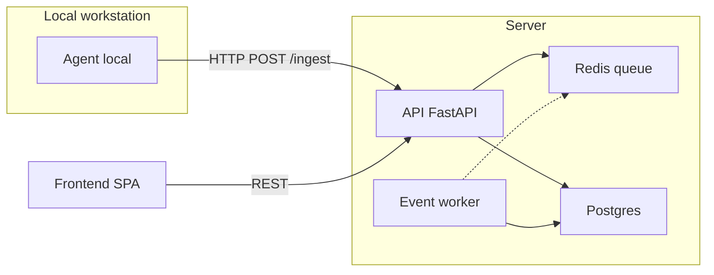
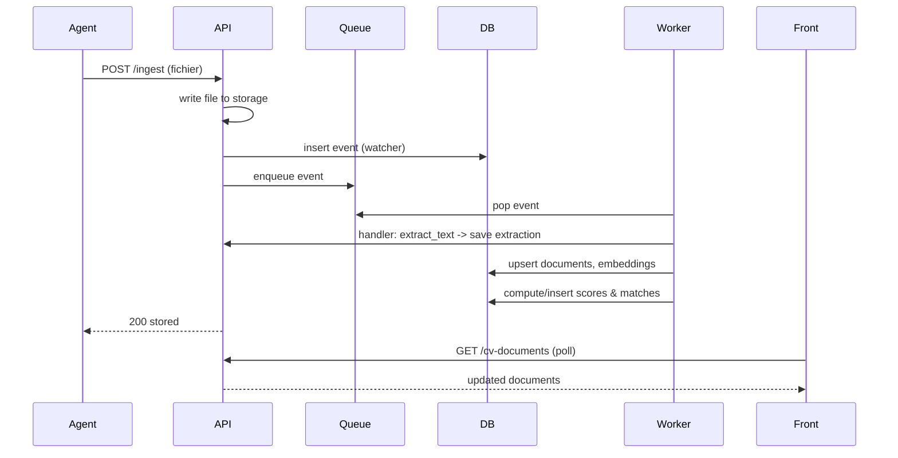
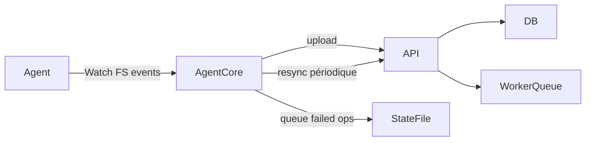

# AI Real-Time — Présentation pour la Direction Générale

Résumé exécutif

- **But** : Plateforme de matching CV ↔ offres en temps réel pour accélérer le sourcing RH.
- **Valeur** : réduction du temps de mise en contact, automatisation de l'extraction/score, tableau de bord opérationnel.
- **État** : MVP fonctionnel (agent local, API backend, worker, frontend). Démonstration prête.

**Points clés**
- Ingestion automatique des CV et offres depuis des dossiers locaux via un agent (push vers API).
- Extraction de texte, calcul d'embeddings et scoring hybride (vectoriel + lexical).
- Pipeline asynchrone avec queue (Redis en prod / file mémoire en fallback) et worker.
- Frontend « Mission Control » : vue unique, panels scrollables, mise à jour automatique.

**Agenda**
- Contexte & objectifs
- Architecture technique (diagrammes)
- Fonctionnalités produit
- Flux de données & cycle de vie d’un fichier (Mermaid)
- Démo (scripts + checks)
- Déploiement & exploitation
- KPI et impact attendu
- Roadmap & recommandations

**Contexte & objectifs**
- Problème : tri manuel des CV et mise en relation lente.
- Objectif : automatiser l’ingestion, la normalisation, l’analyse sémantique et la présentation des meilleurs candidats.
- KPI cibles : temps moyen de sourcing, nombre de correspondances qualifiantes par jour, latence d’ingestion → scoring.

**Architecture Technique (haut niveau)**



**Flux de données (séquence) — ajout d’un CV**



**Diagramme: Résilience & resynchronisation**



Fonctionnalités Produit

- Ingestion (API / agent local / upload manuel)
- Extraction de texte (PDF/DOCX/TXT)
- Embeddings et recherche sémantique (hybride)
- Scoring automatique + journalisation d’événements
- Frontend en une vue : métriques, CV, offres, correspondances
- Mode offline-resilient : agent garde état local et retry

Démo (pas à pas)

- Pré-requis : Docker (pour environ. local) ou run_local_test.sh
- Démarrer l’environnement local (script fourni) :

```bash
# Démarrer backend + frontend en local (script d'environnement)
./scripts/local/run_local_test.sh
```

- Lancer l’agent local (exemple) :

```bash
CV_DIR=$HOME/RH/cv JOB_DIR=$HOME/RH/job API_BASE="http://localhost:8000" ./scripts/local/run_local_test.sh
# ou directement
python3 agent/sync_agent.py --cv-dir $HOME/RH/cv --job-dir $HOME/RH/job --api-base http://localhost:8000 --resync-interval 3
```

- Tester un upload manuel :

```bash
printf "test" > /tmp/ai-rt.txt
curl -s -F "upload=@/tmp/ai-rt.txt" -F "folder=cv" http://localhost:8000/ingest
```

- Vérifier le tableau de bord (localhost:5173 par défaut) → les documents s’affichent automatiquement.

Opérations & Exploitation

- Logs : API (uvicorn logs), agent log → /tmp/ai-realtime-agent.log
- State agent : ~/.ai-realtime-sync/state.json (retry queue)
- Endpoints utiles :
  - `GET /metrics` — métriques runtime
  - `GET /cv-documents` — liste CV
  - `POST /ingest/delete-batch` — supprimer fichiers à distance
  - `POST /maintenance/purge-orphans` — nettoyage

Sécurité

- Auth: possibilité d’utiliser `x-api-key` pour l’agent / uploads
- Bonnes pratiques : restreindre réseau API, stocker clés en vault, limiter upload size

KPI & Impact attendu

- Taux d’automatisation attendu : 70–90% des correspondances initiales
- Réduction du temps moyen pour trouver un candidat : -40% (estimation)
- Latence cible : ingestion → scoring < 10s en cas normal (dépend de l’environnement)

Roadmap & Recommandations

- Court terme (0–2 mois)
  - Stabiliser monitoring (Prometheus + alerting)
  - Ajouter indicateurs UX : badge « Nouvelles correspondances »
  - Tests de montée en charge (queue / worker)
- Moyen terme (2–6 mois)
  - Auth & multi-tenant (si besoin)
  - Améliorer scoring (apprentissage supervise)
  - WebSocket / SSE pour push realtime frontend
- Long terme
  - Intégrations ATS/HRIS
  - Pipelines de feedback (rétroaction des recruteurs) pour améliorer score

Annexes

**Architecture détaillée**
- Backend: FastAPI, SQLAlchemy, PostgreSQL
- Queue: Redis (optionnel, fallback mémoire)
- Agent: Python + watchdog, état local + retry
- Frontend: vanilla JS SPA (single-page dashboard)

**Fichier de démo rapide**
- `scripts/local/run_local_test.sh` — script composite pour lancer frontend + agent et config local.

**Contacts**
- Équipe technique : Chef de projet — (Nom)
- Développement : Équipe Bénin Digital

---

Conclusion

AI Real-Time pose une base solide pour moderniser le traitement des candidatures : l’ingestion est automatisée, les données sont normalisées, le scoring est centralisé et l’équipe dispose d’une vue unique pour piloter l’activité. Le produit est déjà démontrable et peut évoluer vers une intégration plus large avec les outils RH de l’organisation.

La prochaine étape consiste à stabiliser le déploiement de production, renforcer l’observabilité et industrialiser les intégrations métier afin de transformer ce MVP en un service durable, fiable et mesurable.
