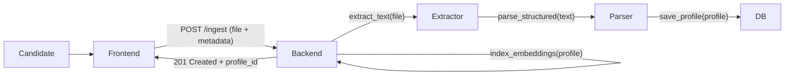
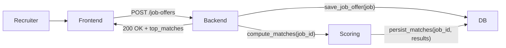
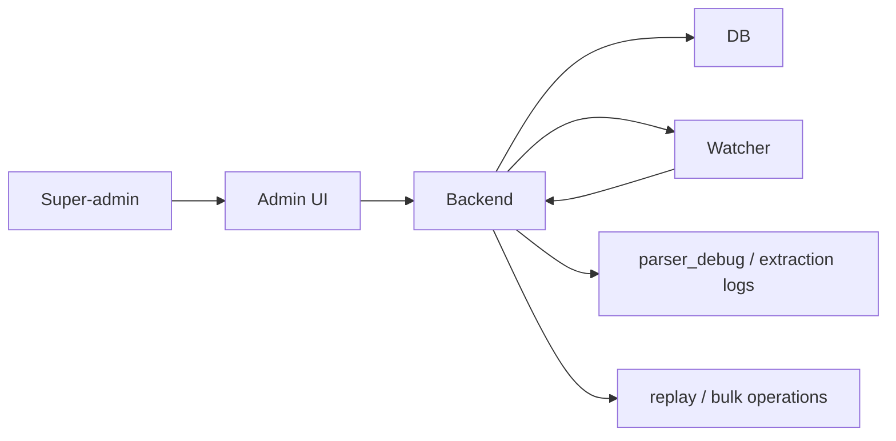
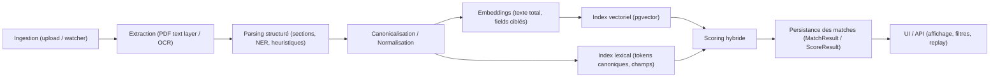

**Rapport d'avancement — AI Real‑Time**

Date: 27 mai 2026

**Résumé global**:
- **Objet**: Plateforme d'appariement CV ↔ offres (extraction, embeddings, scoring hybride, UI).
- **Statut général**: Prototype fonctionnel en local; pipeline extraction → indexation → matching opère, quelques fonctionnalités à stabiliser et UI à compléter.

**Etat des fonctionnalités (par zone)**
- **Ingestion & extraction (backend)**: 90% complete.
  - **Description**: Import de fichiers CV/offres, lecture du texte (layer PDF) et fallback OCR.
  - **Fichiers clés**: [backend/app/services/extraction.py](backend/app/services/extraction.py), [backend/app/main.py](backend/app/main.py)
  - **Statut**: Tests locaux montrent extraction réussie (extracted_len présent). Reste: robustifier OCR pour cas bruités.

- **Parsing structuré (profil CV)**: 75% complete.
  - **Description**: Segmentation en sections, heuristiques + règles pour nom, titre, compétences, durées, langues. Output: profil structuré stocké en base.
  - **Fichiers clés**: [backend/app/services/structured.py](backend/app/services/structured.py)
  - **Statut**: Heuristiques fonctionnent mais nécessitent amélioration (NER/LLM peuvent augmenter fiabilité).

- **Embeddings & index vectoriel**: 80% complete.
  - **Description**: Encodage des textes/champs en vecteurs (pgvector), stockage en tables `CvEmbedding` / `JobEmbedding`.
  - **Fichiers clés**: [backend/app/settings.py](backend/app/settings.py), usage via services d'encodage.
  - **Statut**: Fonctionnel en local; besoin de tests de perf et d'un modèle d'embedding plus léger/performant pour production.

- **Scoring hybride (vectoriel + lexical + structuré)**: 70% complete.
  - **Description**: Recherche top-k vectorielle + score lexical (weighted Jaccard) + boosts par champs (skills, experience, langue). Combinaison pondérée configurable.
  - **Fichiers clés**: [backend/app/services/scoring.py](backend/app/services/scoring.py)
  - **Statut**: Algorithme en place; certains cas donnent score 0.0 (à régler via réglage des poids et enrichissement des lexiques).

- **Persistance des matches & upsert**: 85% complete.
  - **Description**: Résultats normalisés et persistés en `MatchResult` / `ScoreResult`, logique d'upsert corrigée récemment pour re-calculer si aucun match existant.
  - **Fichiers clés**: [backend/app/main.py](backend/app/main.py)
  - **Statut**: Correctif appliqué et commité (commit: 797143a).

- **Watcher / Event replay**: 80% complete.
  - **Description**: Surveillance de répertoires (`/srv/ai-realtime/storage/{cv,job}`) et simulation d'événements pour rejouer ingestions.
  - **Fichiers clés**: [backend/app/main.py](backend/app/main.py), [deploy/local/docker-compose.local.yml](deploy/local/docker-compose.local.yml)
  - **Statut**: Fonctionnel; format JSON correct requis pour `watcher/simulate`.

- **Frontend (UI)**: 60% complete.
  - **Description**: Single‑page JS avec bibliothèque CV, publier offre, liste offres, affichage matches, upload drag/drop.
  - **Fichiers clés**: [frontend/app.js](frontend/app.js), [frontend/index.html](frontend/index.html), [frontend/styles.css](frontend/styles.css)
  - **Statut**: UI de base prête; tâches restantes: ajouter page "Publier un CV" (symétrique à publier offre), finaliser gestion erreurs upload (Failed to fetch), améliorer UX previews.

- **Auth / sécurité**: 90% complete.
  - **Description**: JWT-based endpoints; nombreux endpoints protégés (401 si pas de bearer token).
  - **Fichiers clés**: [backend/app/auth.py](backend/app/auth.py), [backend/app/settings.py](backend/app/settings.py)
  - **Statut**: Fonctionnel ; documenter le workflow d'obtention du token pour QA / démo.

- **Tests unitaires**: 40% complete.
  - **Description**: Quelques tests existants dans `tests/` (scoring, rate limit, security, event queue).
  - **Fichiers clés**: [tests/](tests/)
  - **Statut**: Couverture limitée; priorité: ajouter tests d'intégration extraction→matching.


**Problèmes identifiés & résolus**
- **PermissionError lors de POST /ingest**: cause = utilisateur du container (`appuser`) n'avait pas droits d'écriture sur les volumes host-mounted. Résolution: correction des permissions sur le host.
- **404 récurrents sur preview PDF**: UI déclenchait fetchs sur endpoints non autorisés → suppression/ajustement des boutons "Voir PDF" et logique de preview pour utiliser header Authorization.
- **Matches manquants pour offres publiées via formulaire**: comportement de short-circuit empêchait recalcul — patch appliqué pour re-calculer si aucun match existant (commit: 797143a).


**Décisions techniques & architecture**
- **Stack**: FastAPI backend, SQLAlchemy + Postgres (+pgvector), Redis (optionnel) pour file d'événements, frontend JS léger.
- **Pipeline**: ingestion → extraction (PDF/OCR) → parsing structuré → embeddings → index vectoriel + index lexical → scoring hybride → persistance des matches.
- **Extensibilité**: `settings.py` expose poids et lexiques; `services/` contient composants découplés (extraction, structured, scoring) pour itération.


**Actions recommandées / prochaines étapes (priorisées)**
1. **Ajouter page "Publier un CV"** dans frontend et endpoint symétrique pour ingestion CV (priorité élevée). Fichier à modifier: [frontend/app.js](frontend/app.js), [backend/app/main.py](backend/app/main.py).
2. **Tuning scoring**: augmenter poids lexical/field-boosts et enrichir lexique skills → réduire occurrences de score 0.0. Modify: [backend/app/settings.py](backend/app/settings.py), [backend/app/services/scoring.py](backend/app/services/scoring.py).
3. **Améliorer parsing NER/LLM**: intégrer un petit NER (spaCy) ou un appel LLM local/remote pour extractions structurées plus robustes (name/title/skills). Fichiers concernés: [backend/app/services/structured.py](backend/app/services/structured.py).
4. **Tests d'intégration**: écrire scénario end‑to‑end ingestion CV/offre → génération match → vérification persistance (ajouter sous `tests/`).
5. **Monitoring & logs**: augmenter verbosité `parser_debug` et stocker confidences pour itération des règles.


**Comment reproduire l'état actuel (debug rapide)**
1. Obtenir un token (ex: POST /auth/login) puis utiliser `Authorization: Bearer $TOKEN`.
2. Voir texte extrait et debug pour un CV/offre:

```bash
curl -H "Authorization: Bearer $TOKEN" \
  "http://localhost:8000/cv-documents/161/details?debug=true"
```

3. Rejouer un événement watcher (simuler création d'un fichier):

```bash
curl -X POST -H "Authorization: Bearer $TOKEN" -H "Content-Type: application/json" \
  -d '{"path":"/srv/ai-realtime/storage/job/my-offer.pdf","event_type":"created"}' \
  "http://localhost:8000/watcher/simulate"
```

4. Lister les matches pour un job:

```bash
curl -H "Authorization: Bearer $TOKEN" \
  "http://localhost:8000/matches?job_id=34"
```


**Fichiers modifiés récemment (résumé & liens)**
- Patch recalcul matches: [backend/app/main.py](backend/app/main.py) (commit: 797143a)
- Frontend preview / upload fixes: [frontend/app.js](frontend/app.js), [frontend/index.html](frontend/index.html)
- Permissions / Docker: [deploy/local/docker-compose.local.yml](deploy/local/docker-compose.local.yml)


**Risques & dépendances**
- **Dépendances externes**: modèle d'embeddings, service OCR (Tesseract) et taille modèle LLM éventuel.
- **Risques**: faux positifs/negatifs si lexiques incomplets; performance vector store si dataset grandit (prévoir sharding / ANN engine si nécessaire).


**Annexes / ressources utiles**
- Endpoint d'inspection extraction: `GET /cv-documents/{id}/details?debug=true`
- Endpoint replay: `POST /watcher/simulate`
- Code source principal: [backend/app/main.py](backend/app/main.py), [backend/app/services/extraction.py](backend/app/services/extraction.py), [backend/app/services/scoring.py](backend/app/services/scoring.py)


**User / Admin Stories**
- **User story (Candidat)**: En tant que candidat, je veux pouvoir téléverser mon CV (PDF/Word) et que le système identifie automatiquement mon nom, titre, compétences, années d'expérience et langues pour que je sois trouvé par des offres pertinentes.
- **Admin story (Recruteur)**: En tant que recruteur, je veux publier des offres via le formulaire ou en important des fichiers, et obtenir des listes de candidats classées par pertinence avec visibilité sur les raisons du score (mots-clés communs, similarité vectorielle) pour accélérer la présélection.
- **Super‑admin story (Opérations)**: En tant que super‑admin, je veux gérer les lexiques/poids de scoring, relancer des traitements en masse (replay watcher), et consulter les logs d'extraction pour corriger les règles et améliorer la qualité des parsers.


**Schémas Mermaid (user stories)**

1) Schéma — User (Candidat) :



2) Schéma — Admin (Recruteur) :



3) Schéma — Super‑admin (Opérations) :




**Pipeline (schéma)**
Voici le schéma du pipeline de traitement (lecture gauche → droite) :



Schéma linéaire textuel :

`Ingestion → Extraction (PDF/OCR) → Parsing structuré → Canonicalisation → Embeddings → Index vectoriel + Index lexical → Scoring hybride → Persistance des matches → UI/API`


**Conclusion**
Le projet est à l'état d'un prototype robuste : le pipeline complet fonctionne localement et produit des matches exploitables, les composants clefs (extraction, parsing, embeddings, scoring) sont en place. Les prochaines priorités pour mise en production sont : finaliser l'interface de publication de CV, enrichir les lexiques et intégrations NER/LLM pour fiabiliser l'extraction structurée, et ajouter des tests d'intégration + monitoring. Une fois ces actions réalisées, la solution pourra être mise à l'échelle (optimisation des embeddings, ANN, orchestration) pour un usage réel en production.


---
Rédigé automatiquement pour remise à votre supérieur. Voulez-vous que je génère aussi une version courte (1 page) et un slide deck minimal ?
